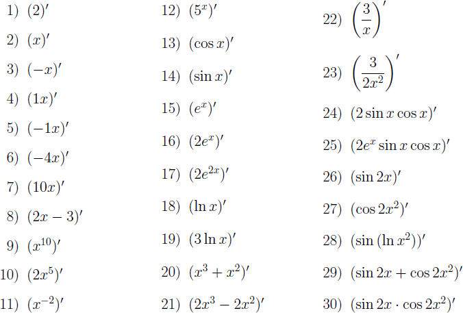

# Домашнее задание №1

При выполнении заданий **не используйте** присваивание и циклы. Избегайте возврата логических значений из условных конструкций. Подготовьте примеры для демонстрации работы разработанных вами процедур.

## 1. Определение дня недели по дате

Определите процедуру `day-of-week`, вычисляющую день недели по дате по григорианскому календарю. Воспользуйтесь алгоритмом, описанным в литературе. Пусть процедура принимает три формальных аргумента (день месяца, месяц и год в виде целых чисел) и возвращает целое число — номер дня в неделе (0 — воскресенье, 1 — понедельник, ... 6 — суббота).

Пример вызова процедуры:

```
(day-of-week 04 12 1975) ⇒ 4
(day-of-week 04 12 2006) ⇒ 1
(day-of-week 29 05 2013) ⇒ 3
```

## 2. Действительные корни квадратного уравнения

Определите процедуру, принимающую коэффициенты *a*, *b* и *c* квадратного уравнения вида *ax*²+*bx*+*c*=0 и возвращающую список чисел &mdash; корней уравнения (один или два корня, или пустой список, если корней нет).

**Указание:** для формирования списка используйте функцию `(list …)`:

```
(list)        → ()
(list 10)     → (10)
(list 10 11)  → (10 11)
```

## 3. НОД, НОК и проверка числа на простоту

Определите:

*  Процедуру `(my-gcd a b)`, возвращающую наибольший общий делитель чисел `a` и `b`. Поведение вашей процедуры должно быть идентично поведению встроенной процедуры `gcd`.

*  Процедуру `(my-lcm a b)`, возвращающую наименьшее общее кратное чисел `a` и `b`. Используйте процедуру `my-gcd`, определенную вами ранее. Поведение вашей процедуры должно быть идентично поведению встроенной процедуры `lcm`.

*  Процедуру `(prime? n)`, выполняющую проверку числа `n` на простоту и возвращающую `#t`, если число простое и `#f` в противном случае.

*  Примеры вызова процедур:

```
(my-gcd 3542 2464) ⇒ 154
(my-lcm 3 4)       ⇒  12
(prime? 11)        ⇒  #t
(prime? 12)        ⇒  #f
```
# Домашнее задание №2

При выполнении заданий **не используйте** присваивание, циклы и обращение
к элементам последовательности по индексу. Избегайте возврата логических
значений из условных конструкций. Подготовьте примеры для демонстрации работы
разработанных вами процедур.

## 1. Обработка списков

Определите следующие процедуры для обработки списков:

* Процедуру `(my-range a b d)`, возвращающую список чисел в интервале
  `[a, b)` с шагом `d`.
* Процедуру `my-flatten`, раскрывающую вложенные списки.
* Предикат `(my-element? x xs)`, проверяющий наличие элемента `x` в списке `xs`.
  Рекомендация: для проверки равенства элементов используйте встроенный
  предикат `equal?`.
* Предикат `(my-filter pred? xs)`, возвращающий список только тех элементов
  списка `xs`, которые удовлетворяют предикату `pred?`.
* Процедуру `(my-fold-left op xs)` для левоассоциативной свертки списка `xs`
  с помощью оператора (процедуры двух аргументов) `op`.
* Процедуру `(my-fold-right op xs)` для правоассоциативной свертки списка `xs`
  с помощью оператора (процедуры двух аргументов) `op`.

Примеры вызова процедур:

```
(my-range  0 11 3) ⇒ (0 3 6 9)

(my-flatten '((1) 2 (3 (4 5)) 6)) ⇒ (1 2 3 4 5 6)

(my-element? 1 '(3 2 1)) ⇒ #t
(my-element? 4 '(3 2 1)) ⇒ #f

(my-filter odd? (my-range 0 10 1))
  ⇒ (1 3 5 7 9)
(my-filter (lambda (x) (= (remainder x 3) 0)) (my-range 0 13 1))
  ⇒ (0 3 6 9 12)

(my-fold-left  quotient '(16 2 2 2 2)) ⇒ 1
(my-fold-left  quotient '(1))          ⇒ 1
(my-fold-right expt     '(2 3 4))      ⇒ 2417851639229258349412352
(my-fold-right expt     '(2))          ⇒ 2
```

## 2. Множества

Реализуйте библиотеку процедур для работы со множествами (для хранения
множеств используйте списки):

* Процедуру `(list->set xs)`, преобразующую список `xs` в множество.
* Предикат `(set? xs)`, проверяющий, является ли список `xs` множеством.
* Процедуру `(union xs ys)`, возвращающую объединение множеств `xs` и `ys`.
* Процедуру `(intersection xs ys)`, возвращающую пересечение множеств `xs` и `ys`.
* Процедуру `(difference xs ys)`, возвращающую разность множеств `xs` и `ys`.
* Процедуру `(symmetric-difference xs ys)`, возвращающую симметричную разность
  множеств `xs` и `ys`.
* Предикат `(set-eq? xs ys)`, проверяющий множества `xs` и `ys` на равенство
  друг другу.
* Примеры вызова процедур (порядок элементов множества не существенен):

```
(list->set '(1 1 2 3))                       ⇒ (3 2 1)
(set? '(1 2 3))                              ⇒ #t
(set? '(1 2 3 3))                            ⇒ #f
(set? '())                                   ⇒ #t
(union '(1 2 3) '(2 3 4))                    ⇒ (4 3 2 1)
(intersection '(1 2 3) '(2 3 4))             ⇒ (2 3)
(difference '(1 2 3 4 5) '(2 3))             ⇒ (1 4 5)
(symmetric-difference '(1 2 3 4) '(3 4 5 6)) ⇒ (6 5 2 1)
(set-eq? '(1 2 3) '(3 2 1))                  ⇒ #t
(set-eq? '(1 2) '(1 3))                      ⇒ #f
```

## 3. Работа со строками

Реализуйте библиотеку процедур для работы со строками. Реализуйте следующие процедуры:

* Процедуры `string-trim-left`, `string-trim-right` и `string-trim`, удаляющие все
  пробельные символы в начале, конце и с обеих сторон строки соответственно.
* Предикаты `(string-prefix? a b)`, `(string-suffix? a b)` и `(string-infix? a b)`,
  соответственно, проверяющие, является ли строка `a` началом строки `b`, окончанием
  строки `b` или строка `a` где-либо встречается в строке `b`.
* Процедуру `(string-split str sep)`, возвращающую список подстрок строки `str`,
  разделённых в строке `str` разделителями `sep`, где `sep` — непустая строка.
  Т.е. процедура `(string-split str sep)` должна разбивать строку на подстроки
  по строке-разделителю `sep`.

**Рекомендуется** преобразовывать входные строки к спискам символов и анализировать
уже эти списки.

Примеры вызова процедур:

```
(string-trim-left  "\t\tabc def")   ⇒ "abc def"
(string-trim-right "abc def\t")     ⇒ "abc def"
(string-trim       "\t abc def \n") ⇒ "abc def"

(string-prefix? "abc" "abcdef")  ⇒ #t
(string-prefix? "bcd" "abcdef")  ⇒ #f
(string-prefix? "abcdef" "abc")  ⇒ #f

(string-suffix? "def" "abcdef")  ⇒ #t
(string-suffix? "bcd" "abcdef")  ⇒ #f

(string-infix? "def" "abcdefgh") ⇒ #t
(string-infix? "abc" "abcdefgh") ⇒ #t
(string-infix? "fgh" "abcdefgh") ⇒ #t
(string-infix? "ijk" "abcdefgh") ⇒ #f
(string-infix? "bcd" "abc")      ⇒ #f

(string-split "x;y;z" ";")       ⇒ ("x" "y" "z")
(string-split "x-->y-->z" "-->") ⇒ ("x" "y" "z")
```

## 4. Многомерные вектора

Реализуйте поддержку типа «многомерный вектор» — вектор произвольной
размерности (1 и более). Пусть элементы такого вектора хранятся не во вложенных
векторах, а в едином одномерном векторе встроенного типа.

Реализуйте следующие процедуры:

* `(make-multi-vector sizes)` и `(make-multi-vector sizes fill)` для создания
многомерного вектора. Число элементов в каждой размерности задается списком
`sizes`. Второй вариант вызова процедуры позволяет заполнить все элементы
значением `fill`.
* `(multi-vector? m)` для определения, является ли `m` многомерным вектором.
Для вектора в общем случае (т.е. для такого, который не является представлением
многомерного вектора) должна возвращать `#f`.
* `(multi-vector-ref m indices)` для получения значения элемента с индексами,
перечисленными в списке `indices`.
* `(multi-vector-set! m indices x)` для присваивания значения `x` элементу
с индексами, перечисленными в списке `indices`.


Примеры вызова процедур:

```
(define m (make-multi-vector '(11 12 9 16)))
(multi-vector? m)
(multi-vector-set! m '(10 7 6 12) 'test)
(multi-vector-ref m '(10 7 6 12)) ⇒ test

; Индексы '(1 2 1 1) и '(2 1 1 1) — разные индексы
(multi-vector-set! m '(1 2 1 1) 'X)
(multi-vector-set! m '(2 1 1 1) 'Y)
(multi-vector-ref m '(1 2 1 1)) ⇒ X
(multi-vector-ref m '(2 1 1 1)) ⇒ Y

(define m (make-multi-vector '(3 5 7) -1))
(multi-vector-ref m '(0 0 0)) ⇒ -1
```

## 5. Композиция функций

Реализуйте композицию функций (процедур) одного аргумента, для чего напишите
процедуру `o`, принимающую произвольное число процедур одного аргумента
и возвращающую процедуру, являющуюся композицией этих процедур.

Примеры применения процедуры:

```
(define (f x) (+ x 2))
(define (g x) (* x 3))
(define (h x) (- x))

((o f g h) 1) ⇒ -1
((o f g) 1)   ⇒ 5
((o h) 1)     ⇒ -1
((o) 1)       ⇒ 1
```

## «Ачивки»

Эти задачки решаются по желанию, в обязательную часть не входят.

* Написать функцию `flatten` без использование функции `append` (или её аналога,
  написанного вручную) — **+1 балл.**
* Написать функцию `flatten` без использование функции `append` (или её аналога,
  написанного вручную), с хвостовой рекурсией — **+2 балла.**
* Написать функцию `list-trim-right`, удаляющую пробельные символы на конце _списка,_
  без реверса этого списка (встроенной функции
  `reverse` или её аналога, написанного вручную) — **+1 балл.**
* Написать функцию `list-trim-right`, удаляющую пробельные символы на конце _списка,_
  без реверса этого списка (встроенной функции
  `reverse` или её аналога, написанного вручную) и работающую со сложностью
  `O(len(xs))` — **+2 балла.**
* При решении задачи № 5 (композиция функций) воспользоваться одной из функций,
  написанных при решении одной из предыдущих задач. Решение должно получиться
  нерекурсивным. **+1 балл.**
# Домашнее задание №3

Реализуйте процедуру `derivative`, находящую производную функции одной переменной по правилам дифференцирования. Пусть процедура принимает один аргумент — выражение на языке Scheme, которой задана функция, и возвращает также выражение на языке Scheme, соответствующее производной. Выражения должны быть пригодны для выполнения с помощью встроенной процедуры `eval`.

Реализуйте нахождение производных константы, линейной, степенной, показательной (включая экспоненту), натурального логарифма, тригонометрических функций (синуса и косинуса), а также суммы, произведения, частного и композиции функций. Не следует ограничивать число слагаемых в сумме, множителей в произведении и функций в композиции. Упрощение выражений не требуется.

Ваша процедура должна находить решения по крайней мере следующих примеров:



Примеры вызова процедуры:

```scheme
(derivative '(expt x 10)) ⇒ (* 10 (expt x 9))
(derivative '(* 2 (expt x 5))) ⇒ (* 2 (* 5 (expt x 4)))
(derivative (list '* 'x 'x)) ⇒ (+ (* x 1) (* 1 x))
```

Рекомендации:

1.  Выбирайте наиболее общие формулы дифференцирования, обработку частных случаев разрабатывайте только при необходимости.

2.  Так как упрощение выражений не предусматривается, вполне приемлемым будет результат вычисления, например, вида `(* 3 (/ 1 x))`, или `(* 2 (expt x 1))`, или `(* 0 (* 2 (expt x 2)))`.

3.  Разрабатывайте программу через тестирование. Для этого реализуйте каркас для юнит-тестирования. На основе приведенных выше примеров напишите набор тестов для вашей процедуры и ведите разработку так, чтобы добиться правильного выполнения всех тестов. Выполняйте тесты после каждого внесения изменений и дополнений в вашу программу.

4.  Предложите способ сделать тесты нечувствительными к способу представления результата, где это возможно. Например, `(* (exp x) (sin x))` на `(* (sin x) (exp x)))` и `(/ 3 x)` `(* 3 (/ 1 x))` должны проходить один и тот же тест.

## «Ачивки»

* Написать функцию `simplify`, упрощающую арифметические выражения: умножения
  на `0` или `1`, сложение с нулём — **+1 балл.**
* Написать макрос `flatten` (т.е. функцию `flatten` из [ДЗ 2](home2.md)
  в виде макроса) — **+1 балл.**
  ```scheme
  (flatten (((+) 1) (2 (3) ((4))))) ⇒ 10
  ```
  т.к.
  ```scheme
  (+ 1 2 3 4) ⇒ 10
  ```
* Написать макрос `mderivative` — **+1 балл.**
  ```scheme
  (define (der-cube x)
    (mderivative (expt x 3)))

  (der-cube 10) ⇒ 300
  ```
# Домашнее задание №4

## 1. Мемоизация

Реализуйте рекурсивные вычисления с использованием оптимизационных техник
&mdash; мемоизации результатов вычислений и отложенных вычислений.

**Важно!** Eсли в программе используются гигиенические макросы
и эта программа будет выполнена в среде guile 1.8.x 
(в том числе на сервере тестирования),
то следует подключить модуль поддержки таких макросов,
написав в начале программы следующую строку:

    (use-syntax (ice-9 syncase))

Реализуйте процедуру _memoized-factorial_ для
вычисления факториала по рекурсивной формуле
с мемоизацией результатов вычислений. Для мемоизации используйте
ассоциативный список (словарь), который храните в статической переменной.
Использовать для этой цели глобальную переменную _запрещается._

Примеры вызова процедур сервером тестирования:

    (begin
      (display (memoized-factorial 10)) (newline)
      (display (memoized-factorial 50)) (newline))
    
    3628800
    30414093201713378043612608166064768844377641568960512000000000000

## 2. Отложенные вычисления

Используя средства языка Scheme для отложенных вычислений,
реализуйте средства для работы с бесконечными &laquo;ленивыми&raquo; 
точечными парами и списками:

* Гигиенический макрос _(lazy-cons a b),_ конструирующий ленивую точечную пару вида
  _(значение-a . обещание-вычислить-значение-b)._
  Почему макрос в данном случае предпочтительнее процедуры?
* Процедуру _(lazy-car p),_ возвращающую значение 1-го элемента &laquo;ленивой&raquo; точечной пары _p._
* Процедуру _(lazy-cdr p),_ возвращающую значение 2-го элемента &laquo;ленивой&raquo; точечной пары _p._

На их основе определите:

* Процедуру <i>(lazy-head xs k)</i>, возвращающую значение <i>k</i> первых элементов
  &laquo;ленивого&raquo; списка <i>xs</i> в виде списка.
* Процедуру <i>(lazy-ref xs k)</i>, возвращающую значение <i>k</i>-го элементa
  &laquo;ленивого&raquo; списка <i>xs</i>.

Продемонстрируйте работу процедур на примере
бесконечного списка натуральных чисел. 
Для этого определите процедуру-генератор <i>(naturals start)</i>, 
возвращающую бесконечный &laquo;ленивый&raquo;
список натуральных чисел, начиная с числа <i>start</i>.

Примеры вызова процедур сервером тестирования:

<pre>
(display (lazy-head (naturals 10) 12)) 
(10 11 12 13 14 15 16 17 18 19 20 21)
</pre>

Реализуйте процедуру <i>(lazy-factorial n)</i>,
которая возвращает значение <i>n</i>!, получая его из
<i>n</i>-го элемента бесконечного списка факториалов.

Примеры вызова процедур сервером тестирования:

<pre>
(begin
  (display (lazy-factorial 10)) (newline)
  (display (lazy-factorial 50)) (newline))

3628800
30414093201713378043612608166064768844377641568960512000000000000
</pre>

## 3. Чтение из потока

Напишите процедуру <i>(read-words)</i>, осуществляющую чтение слов,
разделенных пробельными символами, из
стандартного потока (порта) ввода (сервер тестирования направляет в 
этот поток текстовый файл с примером). Слова в потоке разделены
одним или более пробельными символами. Также пробельные символы могут 
присутствовать перед первым словом и после последнего
слова, такие пробельные символы должны игнорироваться. 
Признак конца файла означает окончание ввода.
Процедура должна возвращать список строк (один элемент списка &mdash; 
одно слово в строке). 
Для пустого файла или файла, содержащего только пробелы, процедура должна
возвращать пустой список.

Анализ потока символов осуществляйте непосредственно при чтении файла,
для чего используйте встроенные процедуры <i>read-char</i>, <i>peek-char</i>, 
<i>eof-object?</i> и 
встроенные предикаты классификации символов.

Пример входных данных (&sdot; &mdash; пробел,  &para; &mdash; конец строки):
<pre>
&sdot;&sdot;one&sdot;two&sdot;three&sdot;&sdot;&sdot;&para;
four&sdot;five&sdot;&sdot;six&sdot;&sdot;&para;
</pre>

Результат вызова процедуры для этих входных данных:
<pre>
(read-words)
  &#8658; ("one" "two" "three" "four" "five" "six")
</pre>

## 4. Структуры (записи)

Используя средства языка Scheme для метапрограммирования, реализуйте каркас поддержки
типа данных &laquo;структура&raquo; (&laquo;запись&raquo;). Пусть объявление нового
типа &laquo;структура&raquo; осуществляется с помощью вызова
(<i>define-struct</i> <i>тип-структуры</i> (<i>имя-поля-1</i> <i>имя-поля-2</i> ... <i>имя-поля-n</i>). Тогда после объявления структуры программисту становятся доступны:

* Процедура &mdash; конструктор структуры вида (<i>make-тип-структуры</i> <i>значение-поля-1</i> <i>значение-поля-2</i> ... <i>значение-поля-n</i>), возвращающий структуру, поля которой инициализированы перечисленными значениями.
* Предикат типа вида (<i>тип-структуры?</i> <i>объект</i>), возврщающая <i>#t</i> если <i>объект</i> является структурой типа <i>тип-структуры</i> и <i>#f</i> в противном случае.
* Процедуры для получения значения каждого из полей структуры вида (<i>тип-структуры-имя-поля</i> <i>объект</i>).
* Процедуры модификации каждого из полей структуры вида (<i>set-тип-структуры-имя-поля!</i> <i>объект</i> <i>новое-значение</i>).

Пример использования каркаса:

<pre>
(define-struct pos (row col)) ; Объявление типа pos
(define p (make-pos 1 2))     ; Создание значения типа pos

(pos? p)    &#8658; #t

(pos-row p) &#8658; 1
(pos-col p) &#8658; 2

(set-pos-row! p 3) ; Изменение значения в поле row
(set-pos-col! p 4) ; Изменение значения в поле col

(pos-row p) &#8658; 3
(pos-col p) &#8658; 4
</pre>

<b>Рекомендация.</b> Для более короткой записи решения можно (но не обязательно) использовать квазицитирование (quasiquotation).

<b>Важно!</b> Если в программе используются гигиенические макросы и эта программа будет выполнена в среде guile 1.8.x (в том числе на сервере тестирования), то следует подключить модуль поддержки таких макросов, написав в начале программы следующую строку:

<pre>
(use-syntax (ice-9 syncase))
</pre>

## 5. Алгебраические типы данных

Используя средства языка Scheme для метапрограммирования, реализуйте каркас поддержки алгебраических типов данных.

Алгебраический тип данных — составной тип, получаемый путем комбинации значений других типов (полей) с помощью функций-конструкторов. Такой тип допускает различные комбинации полей — варианты. Для каждого из вариантов предусматривается свой конструктор. Все варианты типа рассматриваются как один полиморфный тип. Функции (процедуры), работающие с алгебраическим типом, предусматривают отдельные ветви вычислений для каждого из вариантов.

Пример. Необходимо вычислять периметры геометрических фигур (квадратов, прямоугольников, треугольников) и длины окружностей. Для этого в программе определен тип фигура, который может принимать значения квадрат, прямоугольник, треугольник, окружность. Значения создаются с помощью конструкторов (для каждой фигуры — свой конструктор) — процедур, принимающих в качестве аргументов длины сторон (1, 2 или 3 аргумента соответственно) или радиус (для окружности) и возвращающих значение типа фигура:

```
; Определяем тип
;
(define-data figure ((square a)
                     (rectangle a b)
                     (triangle a b c)
                     (circle r)))

; Определяем значения типа
;
(define s (square 10))
(define r (rectangle 10 20))
(define t (triangle 10 20 30))
(define c (circle 10))

; Пусть определение алгебраического типа вводит
; не только конструкторы, но и предикат этого типа:
;
(and (figure? s)
     (figure? r)
     (figure? t)
     (figure? c)) ⇒ #t
```

Функция расчета периметра или длины окружности — единая для всех фигур, принимает значение типа фигура и возвращает значение, вычисленное по формуле, выбранной в соответствии с вариантом фигуры:


```
(define pi (acos -1)) ; Для окружности
  
(define (perim f)
  (match f 
    ((square a)       (* 4 a))
    ((rectangle a b)  (* 2 (+ a b)))
    ((triangle a b c) (+ a b c))
    ((circle r)       (* 2 pi r))))
  
(perim s) ⇒ 40
(perim r) ⇒ 60
(perim t) ⇒ 60
```

Здесь `match` — сопоставление с образцом. В данном примере при вычислении `(perim s)` значение `s` будет сопоставлено с образцом `(square a)`. При этом будет осуществлена подстановка фактического значения `a`, содержащегося в `s`, на место а в выражении `(* 4 a)` справа от образца. Вычисленое значение будет возвращено из конструкции `match`.

**Рекомендации.** Для более короткой записи решения можно (но не обязательно) использовать квазицитирование (quasiquotation).
По литературе и ресурсам Интернет ознакомьтесь с тем, как работает сопоставление с образцом в других языках программирования.


## «Ачивки»

* Объяснить, как и почему работает следующий фрагмент кода:
  ```Scheme
  (((call-with-current-continuation
     (lambda (c) c))
    (lambda (x) x))
   'hello)
  ```
  Можно догадаться, что этот код печатает `hello`, но нужно объяснить почему.
  **+1 балл.**
* Написать макросы `my-let` и `my-let*` без использования эллипсисов (многоточий,
  `...`) (и, конечно, встроенных `let`, `let*`, `letrec`) **+1 балл** за оба.
* Объяснить, почему от перемены мест слагаемых меняется сумма в этом примере
  **(1 балл):**
  

# Домашнее задание №5

Нужно дополнить интерпретатор как минимум тремя из описанных ниже конструкций
на выбор студента. За каждое выполненное расширение (с отдельным подзаголовком)
ставится по одному баллу.

Все расширения интерпретатора опциональны. Чтобы тестирующий бот смог проверить
корректность расширения, в исходный текст программы (в произвольное место,
кроме комментария) нужно добавить символ с именем `feature-***`. Это можно
сделать например так:

```scheme
(define feature-nested-if #t)
```

или так:

```scheme
'feature-nested-if
```

или даже так:

```scheme
(define feature-nested-if
  (list (test (interpret #(0 if 1 if 2 endif 3 endif 4) '()) '(4))
        (test (interpret #(1 if 2 if 3 endif 4 endif 5) '()) '(5 4 3))))

(run-tests feature-nested-if)
```

Имена расширений указаны в скобках в подзаголовках.

В комментариях символы `feature-***` будут проигнорированы.

## `if` с альтернативной веткой (`feature-if-else`)

Предлагается добавить ветку `else` к оператору `if`. Примеры:

```scheme
(interpret #(1 if 100 else 200 endif) '())       →  '(100)
(interpret #(0 if 100 else 200 endif) '())       →  '(200)
```

## Вложенные `if` (`feature-nested-if`)

Внутри оператора `if … endif` допустимы вложенные операторы `if … endif`.
Примеры:

```scheme
(interpret #(0 if 1 if 2 endif 3 endif 4) '())   →  '(4)
(interpret #(1 if 2 if 3 endif 4 endif 5) '())   →  '(5 4 3)
(interpret #(1 if 0 if 2 endif 3 endif 4) '())   →  '(4 3)
```

## Цикл с предусловием `while … wend` (`feature-while-loop`)

Слово `while` работает аналогично слову `if`:

* снимается со стека число,
* если снятое число `0` — передаёт управление на оператор, следующий за `wend`,
* иначе — передаёт управление внутрь тела цикла.

Слово `wend` передаёт управление на предшествующее слово `while`.

Таким образом, цикл продолжается до тех пор, пока слово `while` не снимет
со стека `0`.

Примеры:

```scheme
(interpret #(while wend) '(3 7 4 0 5 9))         → '(5 9)

(interpret #(define sum
               dup
               while + swap dup wend
               drop
             end
             1 2 3 0 4 5 6 sum)
           '())                                  → '(15 3 2 1)

(interpret #(define power2
               1 swap dup
               while
                 swap 2 * swap 1 - dup
               wend
               drop
             end
             5 power2 3 power2 power2) '())      → '(256 32)
```

Цикл должен допускать вложение, если реализован вложенный `if`.

## Цикл с постусловием `repeat … until` (`feature-repeat-loop`)

Слово `repeat` ничего не делает.

Слово `until` снимает со стека число. Если оно нулевое, управление передаётся
на предшествующее слово `repeat`, иначе — на следующую инструкцию.

Таким образом, цикл делает всегда как минимум одну итерацию.

Если реализован вложенный `if`, цикл `repeat … until` также должен допускать
вложение.

## Цикл с параметром `for … next` (`feature-for-loop`)

Цикл `for` в FORTH вызывается, как правило, так:

     for … next : ... ‹от› ‹до›  →  ...

Т.е. цикл снимает со стека два числа `‹от›` и `‹до›` и повторяет тело цикла
для всех чисел в диапазоне `‹от›`…`‹до›` включительно, т.е.
`‹до› − ‹от› + 1` раз.

Внутри цикла можно пользоваться словом `i`, которое кладёт на стек текущее
значение счётчика цикла. (Вне цикла результат работы этого слова не определён.)

Текущее и конечное значение счётчика цикла рекомендуется хранить на стеке
возвратов (см. книжку [Баранова и Ноздрунова][БН]). Таким образом, внутри цикла
`for … next` нельзя будет использовать слово `exit`.

Слово `for` снимает со стека данных и кладёт на стек возвратов значения `‹до›`
(подвершина стека возвратов) и `‹от›` (вершина стека возвратов).

Слово `i` кладёт на стек данных содержимое верхушки стека возвратов, стек
возвратов не меняется.

Слово `next` декрементирует вершину стека возвратов и сравнивает её
с подвершиной:

* если вершина меньше подвершины, то оба значения удаляются из стека возвратов,
  управление передаётся слову, следующему за `next`,
* иначе управление передаётся на слово, следующее за предшествующим `for`.

Цикл `for … next` вложенным можно не реализовывать. (В реализациях FORTH
во вложенных циклах со счётчиком слово `j` позволяет получить значение
счётчика внешнего цикла.)

Пример.

```scheme
(interpret #(define fact
               1 1 rot for i * next
             end
             6 fact 10 fact)
           '())                                  →  (3628800 720)
```

Вместо стека возвратов можно создать третий стек специально для цикла
`for … next`.

## Операторы `break` и `continue` (`feature-break-continue`)

(Один балл за оба.)

Слово `break` прерывает выполнение цикла — выполняет переход на слово,
следующее за словом-окончанием цикла (`wend`, `repeat` или `next`).

Слово `continue` завершает текущую итерацию цикла — выполняет переход
на слово-окончание цикла (`wend`, `repeat` или `next`).

## Конструкция `switch`-`case` (`feature-switch-case`)

**Синтаксис:**

    switch
    …
    case ‹КОНСТ1›  … exitcase …
    …
    case ‹КОНСТn›  … exitcase …
    …
    endswitch

После слова `case` должна располагаться целочисленная константа.

**Семантика** идентична семантике `switch` в Си.

* Слово `switch` снимает со стека число, ищет метку `case` с заданной
  константой (если нашлось несколько меток с одинаковой константой, поведение
  не определено) и переходит на неё. Если константа не найдена, осуществляется
  переход на слово после `endswitch`.
* Слово `case` осуществляет переход на слово после метки.
* Слово `exitcase` осуществляет переход на слово после `endswitch`.
* Слово `endswitch` ничего не делает.

Таким образом, слово `exitcase` эквивалентно `break` внутри `switch` в Си,
через метки, как и в Си, можно «проваливаться».

Аналог метки `default` можно не реализовывать. Вложенные `switch` тоже можно
не реализовывать.

## Статьи высшего порядка — косвенный вызов и лямбды (`feature-hi-level`)

Предлагается добавить в интерпретатор поддержку статей высшего порядка,
аналог функций/процедур высшего порядка в других языках программирования.

**Синтаксис и семантика.**

* Слово `& ‹имя›` требует после себя имя статьи, определённой пользователем,
  при выполнении оставляет на стеке данных адрес статьи — номер слова,
  на который выполнился бы переход при обычном вызове слова. Адрес встроенной
  статьи получить нельзя.
* `lam … endlam` определяет безымянную статью:
  - `lam` помещает на стек данных адрес слова, следующего за словом `lam`
    и осуществляет переход на слово, следующее за `endlam`,
  - `endlam` снимает адрес со стека возвратов и осуществляет на него переход —
    аналогично словам `end` и `exit`.
* `apply` — снимает со стека данных адрес статьи и осуществляет её вызов —
  кладёт на стек возвратов номер слова, следующего за `apply` и осуществляет
  переход на слово, снятое со стека данных.

Пример. Слово `power` применяет функцию указанное количество раз:

```scheme
(interpret #(define power
               ; power : x λ n ≡ λ(λ(λ…λ(x)…)) (n раз)
               dup 0 = if drop drop exit endif
               rot                               ; n  λ  x
               over                              ; n  λ  x  λ
               apply                             ; n  λ  x′
               rot                               ; x′ λ  n
               1 -                               ; x′ λ  n−1
               power                             ; рекурсивный вызов
             end
             define square dup * end
             3 & square 3 power                  ; ((3²)²)² = 6561
             2 lam dup dup * * endlam 2 power    ; (2³)³ = 512
            )
           '())                                  →  (512 6561)
```

Безымянные статьи `lam … endlam` могут быть вложенными.

## Хвостовая рекурсия (`feature-tail-call`)

Слово `tail ‹имя›` осуществляет вызов определённого пользователем слова `‹имя›`
без помещения адреса следующего слова на стек возвратов. Таким образом, остаток
предыдущей статьи игнорируется (на него возврата не будет), вызов `tail ‹имя›`
в некотором смысле эквивалентен `goto`, где роль метки играет определение
статьи.

Поведение `tail ‹имя›` эквивалентно `‹имя› exit` с единственным отличием, что
первое не заполняет стек возвратов.

Пример.

```scheme
(interpret #(define F 11 22 33 tail G 44 55 end
             define G 77 88 99 end
             F)
           '())                                  → (99 88 77 33 22 11)
(interpret #(define =0? dup 0 = end
             define gcd
                 =0? if drop exit endif
                 swap over mod
                 tail gcd
             end
             90 99 gcd
             234 8100 gcd) '())                  → (18 9)
```

## Глобальные переменные (`feature-global`)

* Определение переменной выглядит как `defvar ‹имя› ‹начальное значение›`,
  при выполнении `defvar` определяется слово `‹имя›`, которое кладёт на стек
  текущее значение переменной.
* Запись в переменную осуществляется словом `set ‹имя›`, слово `set` снимает
  со стека число и присваивает его переменной с заданным именем.

Пример.

```scheme
(interpret #(defvar counter 0
             define nextnum
               counter dup 1 + set counter
             end
             nextnum nextnum
             nextnum nextnum +
             nextnum nextnum *)
           '())                                  → (20 5 1 0)
```

[БН]: https://archive.org/details/Baranov.Forth.language.and.its.implementation/mode/2up
# Домашнее задание №6

Реализуйте разбор арифметического выражения, записанного в традиционной инфиксной нотации, и его преобразование к выражению, записанному на языке Scheme. Выражения могут включать в себя числа (целые и с плавающей запятой, в том числе — в экспоненциальной форме), переменные (имена переменных могут состоять из одной или нескольких латинских букв), арифметические операции (`+`, `−`, `*`, `/` и `^`), унарный минус и круглые скобки.

Задание выполните в три этапа:

## 1. Лексический анализатор

Разработайте лексическую структуру языка (грамматику разбора арифметического выражения на токены) и запишите ее в БНФ перед главной процедурой лексера. Процедура должна называться `tokenize`, принимать выражение в виде строки и возвращать последовательность токенов в виде списка. Лексемы исходной последовательности должны быть преобразованы:

имена переменных и знаки операций — в символические константы Scheme,
числа — в числовые константы Scheme соответствующего типа,
скобки — в строки `"("` и `")"`.
Пробельные символы должны игнорироваться лексером. Если исходная последовательность включает в себя недопустимые символы, лексер должен возвращать `#f`.

Примеры вызова лексера:

```
(tokenize "1")
  ⇒ (1)

(tokenize "-a")
  ⇒ (- a)

(tokenize "-a + b * x^2 + dy")
  ⇒ (- a + b * x ^ 2 + dy)

(tokenize "(a - 1)/(b + 1)")
  ⇒ ("(" a - 1 ")" / "(" b + 1 ")")

```

## 2. Синтаксический анализатор

Синтаксический анализатор должен строить дерево разбора согласно следующей грамматике, учитывающей приоритет операторов:

```
Expr    ::= Term Expr' .
Expr'   ::= AddOp Term Expr' | .
Term    ::= Factor Term' .
Term'   ::= MulOp Factor Term' | .
Factor  ::= Power Factor' .
Factor' ::= PowOp Power Factor' | .
Power   ::= value | "(" Expr ")" | unaryMinus Power .
```

где терминалами являются `value` (число или переменная), круглые скобки и знаки операций.

Синтаксический анализатор реализуйте в виде процедуры `parse`, принимающую последовательность токенов в виде списка (результат работы `tokenize`) и возвращающую дерево разбора, представленное в виде вложенных списков вида `(операнд-1 знак-операции операнд-2)` для бинарных операций и `(− операнд)` для унарного минуса. Числа и переменные в списки не упаковывайте. Многократно вложенные друг в друга списки из одного элемента вида `(((имя-или-число)))` не допускаются.

Разбор осуществляйте методом рекурсивного спуска. Если исходная последовательность не соответствует грамматике, парсер должен возвращать `#f`.

При построении дерева разбора соблюдайте общепринятую ассоциативность бинарых операторов: левую для сложения, вычитания, умножения и деления и правую для возведения в степень. Вложенность списков должна однозначно определять порядок вычисления значения выражения.

Примеры вызова парсера:

```
; Ассоциативность левая
;
(parse (tokenize "a/b/c/d"))
  ⇒ (((a / b) / c) / d)

; Ассоциативность правая
;
(parse (tokenize "a^b^c^d"))
  ⇒ (a ^ (b ^ (c ^ d)))

; Порядок вычислений задан скобками
;
(parse (tokenize "a/(b/c)"))
  ⇒ (a / (b / c))

; Порядок вычислений определен только
; приоритетом операций
;
(parse (tokenize "a + b/c^2 - d"))
  ⇒ ((a + (b / (c ^ 2))) - d)

```

## 3. Преобразователь дерева разбора в выражение на Scheme

Реализуйте процедуру `tree->scheme`, преобразующую дерево, возвращенное процедурой `parse`, в выражение на языке Scheme. Полученное выражение должно быть пригодно для вычисления его значения интерпретатором языка Scheme.

Для возведения в степень используйте встроенную процедуру Scheme `expt`. Не передавайте более двух аргументов встроенным процедурам для арифметических операций.

Примеры вызова конвертера:

```
(tree->scheme (parse (tokenize "x^(a + 1)")))
  ⇒ (expt x (+ a 1))

(eval (tree->scheme (parse (tokenize "2^2^2^2")))
      (interaction-environment))
  ⇒ 65536
```
# Домашнее задание №7

Скриптовый язык, на котором будет выполняться лабораторная работа, студентом
выбирается самостоятельно. Примеры возможных скриптовых языков: JavaScipt
(Node.js), Python, Ruby, Lua, Perl, Racket и т.д.

## 1. Утилита `tree`

Реализуйте собственный вариант утилиты `tree`. Пусть ваша программа
поддерживает по меньшей мере ключи `-d` и `-o` так же, как реализация
утилиты `tree` в ОС Linux. Поддержку других ключей можно не реализовывать.

Для «рисования» дерева в консоли используйте символы псевдографики.

Программа не должна аварийно завершаться, если права доступа запрещают
получение списка файлов какого-либо каталога.

## 2. Утилита `grep`

Реализуйте собственный вариант утилиты `grep`. Допускается ограничиться
работой только с текстовыми файлами. Так же, как и стандартная утилита
`grep`, ваша программа должна обрабатывать как стандартный ввод, так
и файлы, пути к которым указаны в командной строке. Ключ `-e` должен
позволять передать программе регулярное выражение вместо строки для поиска.
Пусть ваша реализация также поддерживает ключи `-i`, `-m`, `-n` так же,
как это делает стандартная реализация утилиты `grep`. Поддержку других
ключей можно не реализовывать.

Программа не должна аварийно завершаться, если какой-либо из файлов,
перечисленных в аргументах командной строки, не может быть прочитан.

Сообщения об ошибках и предупреждения должны направляться в стандартный поток
вывода ошибок. **Направление таких сообщений в стандартный поток вывода
не допускается.**

## 3. Утилита `wc`

Реализуйте собственный вариант утилиты `wc`. Так же, как и стандартная утилита
`wc`, ваша программа должна обрабатывать как стандартный ввод, так и файлы,
пути к которым указаны в командной строке. Пусть ваша реализация поддерживает
ключи `-c`, `-m`, `-w`, `-l` так же, как это делает стандартная реализация
утилиты `wc`. Поддержку других ключей можно не реализовывать.

Сообщения об ошибках и предупреждения должны направляться в стандартный поток
вывода ошибок. **Направление таких сообщений в стандартный поток вывода
не допускается.**

## 4. Поиск опечаток

Реализуйте простейшую программу проверки орфографии. Пусть программа принимает
на вход словарь и текст на естественном языке и выводит список и координаты слов
(строка, колонка), которые не встречаются в словаре.

Например, пусть `dictionary.txt` — словарь, а `example-missprint.txt` — текст,
где в строке 1 допущена опечатка в слове `general`, во 2 строке — в слове
`emphasizes` и в 7 строке — в слове `supports` (1-е буквы этих слов находятся
в 25, 23 и 8 колонках соответственно). Тогда вызов и результат работы вашей
программы `speller.py` должен выглядеть так:

```
> ./speller.py dictionary.txt example-missprint.txt
1,  25	  gneral
2,  23	  emphasises
7,   8	  suports
```

Считайте, что в проверяемом тексте переносы слов отсутствуют. Различные формы
одного слова рассматривайте как разные слова. Апостроф считайте частью слова.

### Рекомендации

В виде отдельного модуля реализуйте сканер, преобразующий текст в токены —
слова и знаки пунктуации. Для каждого токена храните его координаты в исходном
тексте — позицию от начала текста, номер строки, номер колонки.

Тестирование программы выполните на примерах коротких английских текстов.

Словарь получите из текста, в котором, как вы считаете, отсутствуют опечатки.
Для получения отдельных слов из этого текста используйте разработанный вами
сканер. Напишите вспомогательную программу, которая будет строить словарь
по тексту, поданному на вход этой программы.

## Ачивка

В качестве скриптового языка выбрать какой-нибудь редкий или необычный язык
**(1 балл).**
