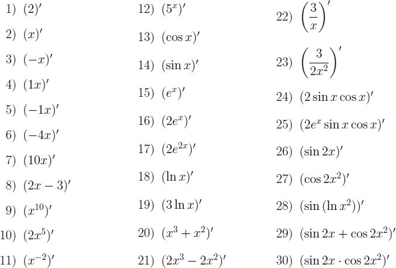

# Домашнее задание №3

Реализуйте процедуру `derivative`, находящую производную функции одной
переменной по правилам дифференцирования. Пусть процедура принимает один
аргумент — выражение на языке Scheme, которой задана функция, и
возвращает также выражение на языке Scheme, соответствующее производной.
Выражения должны быть пригодны для выполнения с помощью встроенной
процедуры `eval`.

Реализуйте нахождение производных константы, линейной, степенной,
показательной (включая экспоненту), натурального логарифма,
тригонометрических функций (синуса и косинуса), а также суммы,
произведения, частного и композиции функций. Не следует ограничивать
число слагаемых в сумме, множителей в произведении и функций в
композиции. Упрощение выражений не требуется.

Ваша процедура должна находить решения по крайней мере следующих
примеров:



Примеры вызова процедуры:

``` scheme
(derivative '(expt x 10)) ⇒ (* 10 (expt x 9))
(derivative '(* 2 (expt x 5))) ⇒ (* 2 (* 5 (expt x 4)))
(derivative (list '* 'x 'x)) ⇒ (+ (* x 1) (* 1 x))
```

Рекомендации:

1.  Выбирайте наиболее общие формулы дифференцирования, обработку
    частных случаев разрабатывайте только при необходимости.

2.  Так как упрощение выражений не предусматривается, вполне приемлемым
    будет результат вычисления, например, вида `(* 3 (/ 1 x))`, или
    `(* 2 (expt x 1))`, или `(* 0 (* 2 (expt x 2)))`.

3.  Разрабатывайте программу через тестирование. Для этого реализуйте
    каркас для юнит-тестирования. На основе приведенных выше примеров
    напишите набор тестов для вашей процедуры и ведите разработку так,
    чтобы добиться правильного выполнения всех тестов. Выполняйте тесты
    после каждого внесения изменений и дополнений в вашу программу.

4.  Предложите способ сделать тесты нечувствительными к способу
    представления результата, где это возможно. Например,
    `(* (exp x) (sin x))` на `(* (sin x) (exp x)))` и `(/ 3 x)`
    `(* 3 (/ 1 x))` должны проходить один и тот же тест.

    ``` scheme
    (define (derivative expr)
      (cond ((not (list? expr)) (cond
                                 ((number? expr) 0)
                                 ((symbol? expr) 1)))
            ((null? (cdr expr)) (derivative (car expr)))
            ((and (symbol? (cadr expr)) (equal? '- (car expr))) -1)
            ((equal? '+ (car expr)) `(+ ,@(map derivative (cdr expr))))
            ((equal? '- (car expr)) `(- ,@(map derivative (cdr expr))))
            ((equal? '* (car expr))
             (if (null? (cddr expr))
                 (derivative (cadr expr))
                 (let ((u (cadr expr))
                       (v (if (null? (cdddr expr))
                              (caddr expr)
                              (cons '* (cddr expr)))))
                   `(+ (* ,(derivative u) ,v)
                       (* ,u ,(derivative v))))))
            ((equal? '/ (car expr))
             (let ((numerator (cadr expr))
                   (denominator (caddr expr)))
               `(/ (- (* ,(derivative numerator) ,denominator)
                      (* ,(derivative denominator) ,numerator))
                   (* ,denominator ,denominator))))
            ((equal? 'expt (car expr))
             (let ((base (cadr expr))
                   (exponent (caddr expr)))
               (if (symbol? base)
                   `(* ,exponent (expt ,base (- ,exponent 1)))
                   `(* ,expr (log ,base) ,(derivative exponent)))))
            ((equal? 'exp (car expr))
             (let ((d (cadr expr)))
               `(* (exp ,d) ,(derivative d))))
            ((equal? 'cos (car expr)) `(* (- (sin ,(cadr expr))) ,(derivative (cadr expr))))
            ((equal? 'sin (car expr)) `(* (cos ,(cadr expr)) ,(derivative (cadr expr))))
            ((equal? 'log (car expr)) `(/ ,(derivative (cadr expr)) ,(cadr expr)))
            (else expr)))
    ```

## «Ачивки»

-   Написать функцию `simplify`, упрощающую арифметические выражения:
    умножения на =0= или `1`, сложение с нулём — **+1 балл.**

    ``` scheme
    (define (simplify expr)
      (cond ((not (list? expr))
             expr)
            ((equal? '+ (car expr))
             (let loop ((expr (cdr expr))
                        (res '()))
               (if (null? expr)
                   (cond ((null? res)
                          0)
                         ((null? (cdr res))
                          (car res))
                         (else (cons '+ (reverse res))))
                   (let ((cur (simplify (car expr))))
                     (if (equal? cur 0)
                         (loop (cdr expr) res)
                         (loop (cdr expr) (cons cur res)))))))
            ((equal? '* (car expr))
             (let loop ((expr (cdr expr))
                        (res '()))
               (if (null? expr)
                   (cond ((null? res)
                          1)
                         ((null? (cdr res))
                          (car res))
                         (else (cons '* (reverse res))))
                   (let ((cur (simplify (car expr))))
                     (cond ((equal? cur 0)
                            0)
                           ((equal? cur 1)
                            (loop (cdr expr) res))
                           (else (loop (cdr expr) (cons cur res))))))))
            (else (let loop ((expr expr)
                             (res '()))
                    (if (null? expr)
                        (reverse res)
                        (loop (cdr expr) (cons (simplify (car expr)) res)))))))
    ```

-   Написать макрос `flatten` (т.е. функцию `flatten`
    из [ДЗ 2](home2.md) в виде макроса) — **+1 балл.**

    ``` scheme
    (flatten (((+) 1) (2 (3) ((4))))) ⇒ 10
    ```

    т.к.

    ``` scheme
    (+ 1 2 3 4) ⇒ 10
    ```

    ``` scheme
    (define-syntax flatten
      (syntax-rules ()
        ((_ done ... ((nested ...) todo ...))
         (flatten done ... (nested ... todo ...)))
        ((_ done ... (first others ...))
         (flatten done ... first (others ...)))
        ((_ done ... ())
         (done ...))))
    ```

-   Написать макрос =mderivative= — **+1 балл.**

    ``` scheme
    (define (der-cube x)
      (mderivative (expt x 3)))

    (der-cube 10) ⇒ 300
    ```

    ``` scheme
    (define-syntax extract
      (syntax-rules ()
        ((extract (first . others))
         (let ((extract-first (extract first))
               (extract-others (extract others)))
           (cond ((and (symbol? 'first) (not (procedure? first))) first)
                 ((not (equal? 'none extract-first)) extract-first)
                 ((not (equal? 'none extract-others)) extract-others)
                 (else 0))))
        ((extract x)
         'none)))

    (define-syntax mderivative
      (syntax-rules ()
        ((mderivative expr)
         (eval `(let ((x ',(extract expr)))
                  ,(derivative 'expr))
               (interaction-environment)))))
    ```
