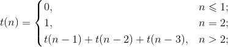
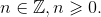

# Лабораторная работа №1

## Цель работы

Приобретение навыков работы с основами программирования на языке Scheme в среде DrRacket.

## Задания

При выполнении заданий **не используйте** присваивание и циклы. Избегайте возврата логических значений из условных конструкций. Продемонстрируйте работоспособность процедур на примерах.

1. Самостоятельно воспроизведите примеры, предложенные преподавателем.

2. Определите предикаты `my-odd?` и `my-even?`, проверяющие целое десятичное число на четность (нечетность).

3. ...


# Лабораторная работа №2. Рекурсия, процедуры высшего порядка, обработка списков

## Цель работы

Приобретение навыков работы с основами программирования на языке Scheme: использование рекурсии, процедур высшего порядка, списков.

## Задания

При выполнении заданий **не используйте** присваивание, циклы и обращение к элементам последовательности по индексу. Избегайте возврата логических значений из условных конструкций. Продемонстрируйте работоспособность процедур на примерах.

1.  Реализуйте процедуру `(count x xs)`, подсчитывающую, сколько раз встречается элемент `x` в списке `xs`. Примеры применения процедуры:

    ```nohighlight
    (count 'a '(a b c a)) ⇒ 2
    (count 'b '(a c d))   ⇒ 0
    (count 'a '())        ⇒ 0
    ```

2.  Реализуйте процедуру `(delete pred? xs)`, которая "удаляет" из списка `xs` все элементы, удовлетворяющие предикату `pred?`. Примеры применения процедуры:

    ```nohighlight
    (delete even? '(0 1 2 3)) ⇒ (1 3)
    (delete even? '(0 2 4 6)) ⇒ ()
    (delete even? '(1 3 5 7)) ⇒ (1 3 5 7)
    (delete even? '()) ⇒ ()
    ```

3.  Реализуйте процедуру `(iterate f x n)`, которая возвращает список из `n` элементов вида `(x, f(x), f(f(x)), f(f(f(x))), …)`, где `f` — процедура (функция) одного аргумента. Примеры применения процедуры:

    ```nohighlight
    (iterate (lambda (x) (* 2 x)) 1 6) ⇒ (1 2 4 8 16 32)
    (iterate (lambda (x) (* 2 x)) 1 1) ⇒ (1)
    (iterate (lambda (x) (* 2 x)) 1 0) ⇒ ()
    ```

4.  Реализуйте процедуру `(intersperse e xs)`, которая возвращает список, полученный путем вставки элемента `е` между элементами списка `xs`. Примеры применения процедуры:

    ```nohighlight
    (intersperse 'x '(1 2 3 4)) ⇒ (1 x 2 x 3 x 4)
    (intersperse 'x '(1 2))     ⇒ (1 x 2)
    (intersperse 'x '(1))       ⇒ (1)
    (intersperse 'x '())        ⇒ ()
    ```

5.  Реализуйте предикаты `(any? pred? xs)`, который возвращает `#t`, если хотя бы один из элементов списка `xs` удовлетворяет предуикату `pred?`, и `(all? pred? xs)`, который возвращает `#t`, если все элементы списка `xs` удовлетворяет предуикату `pred?`. **Не используйте** условные конструкции, вместо них используйте особенности встроенных `and` и `or`. Примеры применения:

    ```nohighlight
    (any? odd? '(1 3 5 7)) ⇒ #t
    (any? odd? '(0 1 2 3)) ⇒ #t
    (any? odd? '(0 2 4 6)) ⇒ #f
    (any? odd? '()) ⇒ #f
    
    (all? odd? '(1 3 5 7)) ⇒ #t
    (all? odd? '(0 1 2 3)) ⇒ #f
    (all? odd? '(0 2 4 6)) ⇒ #f
    (all? odd? '()) ⇒ #t ; Это - особенность, реализуйте её
    ```

6.  Реализуйте композицию функций (процедур) одного аргумента, для чего напишите процедуру `o`, принимающую произвольное число процедур одного аргумента и возвращающую процедуру, являющуюся композицией этих процедур.  Примеры применения процедуры:

    ```nohighlight
    (define (f x) (+ x 2))
    (define (g x) (* x 3))
    (define (h x) (- x))
    
    ((o f g h) 1) ⇒ -1
    ((o f g) 1)   ⇒ 5
    ((o h) 1)     ⇒ -1
    ((o) 1)       ⇒ 1
    ```


# Лабораторная работа №3

## Цели работы

+   На практике ознакомиться с системой типов языка Scheme.
+   На практике ознакомиться с юнит-тестированием. 
+   Разработать свои средства отладки программ на языке Scheme.
+   На практике ознакомиться со средствами метапрограммирования языка Scheme.

## Задания

1.  Реализуйте макрос `trace` для трассировки. Трассировка — способ отладки, при котором отслеживаются значения переменных или выражений на каждом шаге выполнения программы. Необходимость и вывести значение в консоль, и вернуть его в программу нередко требует существенной модификации кода, что может стать источником дополнительных ошибок. Реализуйте макрос, который позволяет ценой небольшой вставки, не нарушающей декларативность кода, выполнить и вывод значения в консоль с комментарием в виде текста выражения, которое было вычислено, и возврат его значения в программу.

    Код без трассировки:
    
    ```scheme
    (define (zip . xss)
      (if (or (null? xss)
              (null? (car xss))) ; Надо отслеживать значение (car xss) здесь...
          '()
          (cons (map car xss)
                (apply zip (map cdr xss))))) ; ...и значение xss здесь.
    ```
    
    Код с трассировкой:
    
    ```scheme
    (load "trace.scm")

    (define (zip . xss)
      (if (or (null? xss)
              (null? (trace-ex (car xss)))) ; Здесь...
          '()
          (cons (map car xss)
                (apply zip (map cdr (trace-ex xss)))))) ; ... и здесь
    ```
    
    Консоль:
    
    ```nohighlight
    > (zip '(1 2 3) '(one two three))
    (car xss) => (1 2 3)
    xss => ((1 2 3) (one two three))
    (car xss) => (2 3)
    xss => ((2 3) (two three))
    (car xss) => (3)
    xss => ((3) (three))
    (car xss) => ()
    ((1 one) (2 two) (3 three))
    ```
    
    Вычисление значения выражения осуществляется после вывода цитаты этого выражения в консоль. Таким образом, в случае аварийного завершения программы из-за невозможности вычисления значения, вы всегда сможете определить, в каком выражении возникает ошибка.
    
    **Проследите, чтобы выражение вычислялось ровно один раз**, в противном случае можно получить неверный результат работы программы.

    В дальнейшем используйте этот макрос при отладке своих программ на языке Scheme.
    
2.  Юнит-тестирование — способ проверки корректности отдельных относительно независимых частей программы. При таком подходе для каждой функции (процедуры) пишется набор тестов — пар "выражение — значение, которое должно получиться". Процесс тестирования заключается в вычислении выражений тестов и автоматизированном сопоставлении результата вычислений с ожидаемым результатом. При несовпадении выдается сообщение об ошибках.

    Реализуйте свой каркас для юнит-тестирования. Пусть каркас включает следующие компоненты:

    +   Макрос `test` — конструктор теста вида `(выражение ожидаемый-результат)`.
    
    +   Процедуру `run-test`, выполняющую отдельный тест. Если вычисленный результат совпадает с ожидаемым, то в консоль выводятся выражение и признак того, что тест пройден. В противном случае выводится выражение, признак того, что тест не пройден, а также ожидаемый и фактический результаты. Функция возвращает `#t`, если тест пройден и `#f` в противном случае. Вывод цитаты выражения в консоль должен выполняться до вычисления его значения, чтобы при аварийном завершении программы последним в консоль было бы выведено выражение, в котором произошла ошибка.
    
    +   Процедуру `run-tests`, выполняющую серию тестов, переданную ей в виде списка. Эта процедура должна выполнять все тесты в списке и возвращает `#t`, если все они были успешными, в противном случае процедура возвращает `#f`. 
    
    Какой предикат вы будете использовать для сравнения ожидаемого результата с фактическим? Почему?

    Пример:
    
    ```scheme
    ; Пример процедуры с ошибкой
    ; 
    (define (signum x)
      (cond
        ((< x 0) -1)
        ((= x 0)  1) ; Ошибка здесь!
        (else     1)))

    ; Загружаем каркас
    ;
    (load "unit-test.scm")

    ; Определяем список тестов
    ;
    (define the-tests
      (list (test (signum -2) -1)
            (test (signum  0)  0)
            (test (signum  2)  1)))

    ; Выполняем тесты
    ;
    (run-tests the-tests)
    ```
    
    Пример результата в консоли:

    ```nohighlight
    (signum -2) ok
    (signum 0) FAIL
      Expected: 0
      Returned: 1
    (signum 2) ok
    #f
    ```
    
    Используйте разработанные вами средства отладки для выполнения следующих заданий этой лабораторной работы и последующих домашних заданий.
    
3.  Реализуйте процедуру доступа к произвольному элементу последовательности (правильного списка, вектора или строки) по индексу. Пусть процедура возвращает `#f` если получение элемента не возможно. Примеры применения процедуры:

    ```scheme
    (ref '(1 2 3) 1) ⇒ 2
    (ref #(1 2 3) 1) ⇒ 2
    (ref "123" 1)    ⇒ #\2
    (ref "123" 3)    ⇒ #f
    ```
    
    Реализуйте процедуру "вставки" произвольного элемента в последовательность, в позицию с заданным индексом (процедура возвращает новую последовательность). Пусть процедура возвращает `#f` если вставка не может быть выполнена. Примеры применения процедуры:
    
    ```scheme
    (ref '(1 2 3) 1 0)   ⇒ (1 0 2 3)
    (ref #(1 2 3) 1 0)   ⇒ #(1 0 2 3)
    (ref #(1 2 3) 1 #\0) ⇒ #(1 #\0 2 3)
    (ref "123" 1 #\0)    ⇒ "1023"
    (ref "123" 1 0)      ⇒ #f
    (ref "123" 3 #\4)    ⇒ "1234"
    (ref "123" 5 #\4)    ⇒ #f
    ```
    
    Попробуйте предусмотреть все возможные варианты.
    
    **Примечание.** Результатом выполнения задания должно быть **одно** определение процедуры `ref`. Алгоритм её работы должен определяться числом аргументов и их типами.

4.  Разработайте наборы юнит-тестов и используйте эти тесты для разработки процедуры, выполняющей разложение на множители.

    Реализуйте процедуру `factorize`, выполняющую разложение многочленов
вида <i>a</i><sup>2</sup>−<i>b</i><sup>2</sup>, 
<i>a</i><sup>3</sup>−<i>b</i><sup>3</sup> 
и <i>a</i><sup>3</sup>+<i>b</i><sup>3</sup> по формулам. 

    Пусть процедура принимает единственный аргумент — выражение на языке Scheme, которое следует разложить на множители, и возвращает преобразованное выражение. Возведение в степень в исходных выражениях пусть будет реализовано с помощью встроенной процедуры expt. Получаемое выражение должно быть пригодно для выполнения в среде интерпретатора с помощью встроенной процедуры eval. Упрощение выражений не требуется.

    Примеры вызова процедуры:

    ```
    (factorize '(- (expt x 2) (expt y 2))) 
      ⇒ (* (- x y) (+ x y))
  
    (factorize '(- (expt (+ first 1) 2) (expt (- second 1) 2)))
      ⇒ (* (- (+ first 1) (- second 1))
             (+ (+ first 1) (- second 1)))
             
    (eval (list (list 'lambda 
                          '(x y) 
                          (factorize '(- (expt x 2) (expt y 2))))
                    1 2)
              (interaction-environment))
      ⇒ -3
    ```

# Лабораторная работа №4

## Цели работы

На примере языка Scheme ознакомиться со средствами метапрограммирования
(«код как данные», макросы) и подходами к оптимизации вычислений (мемоизация
результатов вычислений, отложенные вычисления).

В работе также предлагается разработать дополнительное средство отладки программ —
каркас для отладки с помощью утверждений. На этом примере предлагается ознакомится
с типичным применением программирования с использованием продолжений.


## Задания

### 1. Продолжения.

Утверждение (assertion) — проверка на истинность некоторого условия, заданного
программистом. По традиции осуществляется процедурой (функцией)
с именем `assert`. Включается в код во время написания кода и отладки
с целью установки ограничений на значения и выявления недопустимых значений.
Если в процессе выполнения программы указанное условие нарушается, то программа
завершается с выводом диагностического сообщения о том, какое условие было
нарушено. Если условие соблюдено, то выполнение программы продолжается, никаких
сообщений не выводится.

Реализуйте каркас (фреймворк) для отладки с помощью утверждений. Пусть Ваш каркас
перед использованием инициализируется вызовом `(use-assertions)`, а сами
утверждения записываются в коде ниже в виде `(assert условие)`. Если условие
не выполнено, происходит завершение работы программы без возникновения ошибки
выполнения и вывод в консоль диагностического сообщения вида `FAILED: условие`.
Пример использования каркаса:

```Scheme
(use-assertions) ; Инициализация вашего каркаса перед использованием

; Определение процедуры, требующей верификации переданного ей значения:

(define (1/x x)
  (assert (not (zero? x))) ; Утверждение: x ДОЛЖЕН БЫТЬ ≠ 0
  (/ 1 x))

; Применение процедуры с утверждением:

(map 1/x '(1 2 3 4 5)) ; ВЕРНЕТ список значений в программу

(map 1/x '(-2 -1 0 1 2)) ; ВЫВЕДЕТ в консоль сообщение и завершит работу программы
```

Сообщение, которое должно быть выведено при выполнении примера, показанного выше:

```nohighlight
FAILED: (not (zero? x))
```

Важно! Если в программе используются гигиенические макросы и эта программа будет
выполнена в среде guile 1.8.x (в том числе на сервере тестирования), то следует
подключить модуль поддержки таких макросов, написав в начале программы следующую
строку:

```nohighlight
(use-syntax (ice-9 syncase))
```

### 2. Код как данные. Порты ввода-вывода.

- *Сериализация данных.* Реализуйте процедуры для записи данных из переменной
  в файл по заданному пути (т.е. для сериализации) и последующего чтения данных
  (десериализации) из такого файла:

  ```nohighlight
  (save-data данные путь-к-файлу)
  (load-data путь-к-файлу) ⇒ данные
  ```

- *Подсчет строк в текстовом файле.* Реализуйте процедуру, принимающую в качестве
  аргумента путь к текстовому файлу и возвращающую число *непустых* строк в этом
  файле. Используйте процедуры, разработанные вами ранее в рамках выполнения
  домашних заданий.

### 3. Мемоизация результатов вычислений.

Реализуйте функцию вычисления n-го "числа
трибоначчи" (последовательности чисел, которой первые три числа равны соответственно
0, 0 и 1, а каждое последующее число — сумме предыдущих трех чисел):





Реализуйте версию этой функции с мемоизацией результатов вычислений. Сравните время
вычисления значения функций для разных (умеренно больших) значений её аргументов без
мемоизации и с мемоизацией. Для точного измерения вычисления рекомендуется
использовать команду REPL Guile `time` (Guile 2.x).

### 4. Отложенные вычисления.

Используя примитивы для отложенных вычислений `delay`
и `force`, реализуйте макрос `my-if`, который полностью воспроизводит поведение
встроенной условной конструкции (специальной формы) `if` для выражений, возвращающих
значения. Например, такие примеры должны вычисляться корректно:

```nohighlight
(my-if #t 1 (/ 1 0)) ⇒ 1
(my-if #f (/ 1 0) 1) ⇒ 1
```

*Запрещается* использовать встроенные условные конструкции `if`, `cond`, `case`
и перехват исключений.

### 5. Локальные определения.

Реализуйте макросы `my-let` и `my-let*`, полностью
воспроизводящие поведение встроенных макросов `let` и `let*`.

### 6. Управляющие конструкции.

Используя _гигиенические_ макросы языка Scheme, реализуйте управляющие
конструкции, свойственные императивным языкам программирования.

#### А. Условия _when_ и _unless_

Напишите макросы:

* _(when cond? expr<sub>1</sub> expr<sub>2</sub> ... expr<sub>n</sub>)_,
который _выполняет_ последовательность выражений
_expr<sub>1</sub> expr<sub>2</sub> ... expr<sub>n</sub>_, если условие
_cond?_ истинно.
* _(unless cond? expr<sub>1</sub> expr<sub>2</sub> ... expr<sub>n</sub>)_,
который _выполняет_ последовательность выражений
_expr<sub>1</sub> expr<sub>2</sub> ... expr<sub>n</sub>_, если условие
_cond?_ ложно.

Предполагается, что _when_ и _unless_ возвращают результат последнего
вычисленного в них выражения. _When_ и _unless_ могут быть вложенными.

Пример:

```Scheme
; Пусть x = 1
;
(when   (> x 0) (display "x > 0")  (newline))
(unless (= x 0) (display "x != 0") (newline))
```

В стандартный поток будет выведено:

```
x > 0
x != 0
```

#### Б. Циклы _for_

Реализуйте макрос _for_, который позволит организовывать циклы
с переменной &mdash; параметром цикла. Определение должно допускать
две различных формы записи:

* _(for x in xs expr<sub>1</sub> expr<sub>2</sub> ... expr<sub>n</sub>)_ и
* _(for xs as x expr<sub>1</sub> expr<sub>2</sub> ... expr<sub>n</sub>),_

где _x_ &mdash; переменная, _xs_ &mdash; список значений, которые должна принимать,
переменная на каждой итерации,
_expr<sub>1</sub> expr<sub>2</sub> ... expr<sub>n</sub>_ &mdash;
последовательность инструкций, которые должны быть выполнены в теле цикла.

Примеры применения:

```Scheme
(for i in '(1 2 3)
  (for j in '(4 5 6)
    (display (list i j))
    (newline)))

(for '(1 2 3) as i
  (for '(4 5 6) as j
    (display (list i j))
    (newline)))
```

#### В. Цикл _while_

Реализуйте макрос _while_, который позволит организовывать циклы
с предусловием:

_(while cond? expr<sub>1</sub> expr<sub>2</sub> ... expr<sub>n</sub>)_,

где _cond?_ &mdash; условие, _expr<sub>1</sub> expr<sub>2</sub> ... expr<sub>n</sub>_ &mdash;
последовательность инструкций, которые должны быть выполнены в теле цикла.
Проверка условия осуществляется перед каждой итерацией, тело цикла выполняется,
если условие выполняется. Если при входе в цикл условие не выполняется, то
тело цикла не будет выполнено ни разу.

Пример применения:

```Scheme
(let ((p 0)
      (q 0))
  (while (< p 3)
         (set! q 0)
         (while (< q 3)
                (display (list p q))
                (newline)
                (set! q (+ q 1)))
         (set! p (+ p 1))))
```

Выведет:
```
(0 0)
(0 1)
(0 2)
(1 0)
(1 1)
(1 2)
(2 0)
(2 1)
(2 2)
```

_Рекомендация._ Целесообразно разворачивать макрос в вызов анонимной
процедуры без аргументов со статической переменной, содержащей анонимную
процедуру с проверкой условия, рекурсивным вызовом и телом цикла. Для
краткой записи такой процедуры и ее вызова
можно использовать встроенную конструкцию
_letrec_, которая аналогична _let_ и _let*_, но допускает
рекурсивные определения, например:

```
(letrec ((iter (lambda (i)
                 (if (= i 10)
                     '()
                     (cons i (iter (+ i 1)))))))
  (iter 0))
  => (0 1 2 3 4 5 6 7 8 9)
```


#### Г. Цикл _repeat..until_

Реализуйте макрос _repeat..until_, который позволит организовывать циклы
с предусловием:

_(repeat (expr<sub>1</sub> expr<sub>2</sub> ... expr<sub>n</sub>)
until cond?)_,

где _cond?_ &mdash; условие, _expr<sub>1</sub> expr<sub>2</sub> ... expr<sub>n</sub>_ &mdash;
последовательность инструкций, которые должны быть выполнены в теле цикла.
Проверка условия осуществляется после каждой итерации.
Если условие возвращает истину, цикл завершается, иначе цикл выполняется снова.
Таким образом, тело цикла выполняется по меньшей мере 1 раз.

Например:

```Scheme
(let ((i 0)
      (j 0))
  (repeat ((set! j 0)
           (repeat ((display (list i j))
                    (set! j (+ j 1)))
                   until (= j 3))
           (set! i (+ i 1))
           (newline))
          until (= i 3)))
```

Выведет:

```
(0 0)(0 1)(0 2)
(1 0)(1 1)(1 2)
(2 0)(2 1)(2 2)
```

Подумайте, зачем требуется заключать тело цикла в круглые скобки? Как
изменится макрос, если отказаться от этих скобок?


#### Д. Вывод &laquo;в стиле С++&raquo;

Реализуйте макрос для последовательного вывода значений в стандартный поток
вывода вида:

```
(cout << "a = " << 1 << endl << "b = " << 2 << endl)
```

Здесь _cout_ &mdash;  имя макроса, указывающее, что
будет осуществляться вывод в консоль (от console output),
символы _&lt;&lt;_ разделяют значения, _endl_ означает переход на новую строку.

Данный пример выведет следующий текст:
```
a = 1
b = 2
```
# Лабораторная работа №5
## Интерпретатор стекового языка программирования
### Условие задачи

Реализуйте интерпретатор стекового языка программирования, описание которого
представлено ниже. Интерпретатор должен вызываться
как процедура `(interpret program stack)` которая принимает программу
на исходном языке `program` и начальное состояние стека данных
`stack` и возвращает его состояние после вычисления программы.
Программа на исходном языке задана вектором литеральных констант,
соответствующих словам исходного языка. Исходное и конечное состояния стека
данных являются списком, голова которого соответствует вершине стека.

Примеры вызова интерпретатора (здесь и далее в примерах код на
исходном языке выделен синим цветом):

<pre>
(interpret #(   <span style="color: blue;">define abs
                  dup 0 &lt;
                  if neg endif
                end
                abs</span>    ) ; программа
           '(-9))        ; исходное состояние стека
  &#8658; (9)
</pre>

При реализации интерпретатора избегайте императивных конструкций, используйте
модель вычислений без состояний. Для хранения программы и состояния интерпретатора
**запрещается** использовать глобальные переменные. Перечисленные
ниже встроенные слова обязательны для реализации и будут
проверены сервером тестирования.

### Описание языка

Язык, интерпретатор которого следует реализовать,
является видоизмененным ограниченным подмножеством
языка <a href="http://ru.wikipedia.org/wiki/Forth" target="_blank">Forth</a>.

В нашем языке операции осуществляются с целыми числами.
Используется постфиксная запись операторов.
Все вычисления осуществляются на стеке данных. Стек данных является глобальным.
При запуске интерпретатора стек может быть инициализирован
некоторыми исходными данными или быть пустым.

Программа на исходном языке представляет собой последовательность слов.
Интерпретатор анализирует слова по очереди. Если слово является целым числом,
то оно число помещается на вершину стека данных. В противном случае слово
интерпретируется как оператор (процедура). Если в программе уже встретилось
определение этого слова (статья), то выполняется код этого определения.
В противном случае слово рассматривается как встроенное в интерпретатор и
выполняется соответствующей процедурой интерпретатора. Затем осуществляется
возврат из процедуры (переход к слову, следующему за последним вызовом).
Выполнение программы заканчивается, когда выполнено последнее слово.

Процедуры (операторы) снимают свои аргументы с вершины стека данных и
кладут результат вычислений также на вершину стека данных.

Ввод-вывод или какое-либо взаимодействие с пользователем не предусматривается.

Например:

<pre>
(interpret #(<span style="color: blue;">2 3 * 4 5 * +</span>) '()) &#8658; (26)
</pre>

### Встроенные слова

Ниже представлен список встроенных слов с кратким описанием их значений.
Состояние стека до и после интерпретации каждого слова показаны с помощью
схем &mdash; стековых диаграмм. Порядок, в котором элементы были помещены в стек,
отражен в индексах элементов. Например, программа:

<pre>
<span style="color: blue;">1 2 3</span>
</pre>

может быть показана стековой диаграммой () &#8594; (1 2 3)

<small><b>Внимание!</b> В нашем интерпретаторе в качестве стека используется
список. Голова этого списка является вершиной стека, поэтому вершина стека
в этих диаграммах находится <em>слева</em>!
Такая запись отличается от традиционных стековых диаграмм,
принятых, например, в языке Forth, в которых голова стека записывается
<em>справа</em>.</small>

#### Арифметические операции

<table>
<tr><td style="text-align: left; vertical-align: top;">+        </td><td style="text-align: left; vertical-align: top;">(n2 n1) &#8594; (сумма)             </td><td style="text-align: left; vertical-align: top;">Сумма n1 и n2</td></tr>
<tr><td style="text-align: left; vertical-align: top;">&minus;  </td><td style="text-align: left; vertical-align: top;">(n2 n1) &#8594; (разность)          </td><td style="text-align: left; vertical-align: top;">Разность: n1 &minus; n2</td></tr>
<tr><td style="text-align: left; vertical-align: top;">*        </td><td style="text-align: left; vertical-align: top;">(n2 n1) &#8594; (произведение)&nbsp;</td><td style="text-align: left; vertical-align: top;">Произведение n2 на n1</td></tr>
<tr><td style="text-align: left; vertical-align: top;">/        </td><td style="text-align: left; vertical-align: top;">(n2 n1) &#8594; (частное)           </td><td style="text-align: left; vertical-align: top;">Целочисленное деление n1 на n2</td></tr>
<tr><td style="text-align: left; vertical-align: top;">mod&nbsp;</td><td style="text-align: left; vertical-align: top;">(n2 n1) &#8594; (остаток)           </td><td style="text-align: left; vertical-align: top;">Остаток от деления n1 на n2</td></tr>
<tr><td style="text-align: left; vertical-align: top;">neg      </td><td style="text-align: left; vertical-align: top;">(n) &#8594; (&minus;n)              </td><td style="text-align: left; vertical-align: top;">Смена знака числа</td></tr>
</table>

#### Операции сравнения

<table>
<tr><td style="text-align: left; vertical-align: top;">=&nbsp;</td><td style="text-align: left; vertical-align: top;">(n2 n1) &#8594; (флаг) &nbsp;</td><td style="text-align: left; vertical-align: top;">Флаг равен &minus;1, если n1 = n2, иначе флаг равен 0</td></tr>
<tr><td style="text-align: left; vertical-align: top;">&gt;   </td><td style="text-align: left; vertical-align: top;">(n2 n1) &#8594; (флаг) &nbsp;</td><td style="text-align: left; vertical-align: top;">Флаг равен &minus;1, если n1 &gt; n2, иначе флаг равен 0</td></tr>
<tr><td style="text-align: left; vertical-align: top;">&lt;   </td><td style="text-align: left; vertical-align: top;">(n2 n1) &#8594; (флаг) &nbsp;</td><td style="text-align: left; vertical-align: top;">Флаг равен &minus;1, если n1 &lt; n2, иначе флаг равен 0</td></tr>
</table>

аким образом, булевы значения представлены с помощью целых чисел:
&minus;1 соответствует значению &laquo;истина&raquo;, 0 &mdash; значению &laquo;ложь&raquo;.

#### Логические операции

<table>
<tr><td style="text-align: left; vertical-align: top;">not&nbsp;</td><td style="text-align: left; vertical-align: top;">(n)     &#8594; (результат)&nbsp;</td><td style="text-align: left; vertical-align: top;">НЕ n</td></tr>
<tr><td style="text-align: left; vertical-align: top;">and&nbsp;</td><td style="text-align: left; vertical-align: top;">(n2 n1) &#8594; (результат)&nbsp;</td><td style="text-align: left; vertical-align: top;">n2 И n1</td></tr>
<tr><td style="text-align: left; vertical-align: top;">or       </td><td style="text-align: left; vertical-align: top;">(n2 n1) &#8594; (результат)&nbsp;</td><td style="text-align: left; vertical-align: top;">n2 ИЛИ n1</td></tr>
</table>

Эти операции также должны давать правильный результат, если в одном или
обеих операндах &laquo;истина&raquo; представлена любым ненулевым целым числом.

#### Операции со стеком

При выполнении вычислений на стеке часто возникает необходимость
изменять порядок следования элементов, удалять значения,
копировать их и т.д. Для этого реализуйте следующие операции:

<table>
<tr><td style="text-align: left; vertical-align: top;">drop       </td><td style="text-align: left; vertical-align: top;">(n1)       &#8594; () &nbsp;       </td><td style="text-align: left; vertical-align: top;">Удаляет элемент на вершине стека</td></tr>
<tr><td style="text-align: left; vertical-align: top;">swap       </td><td style="text-align: left; vertical-align: top;">(n2 n1)    &#8594; (n1 n2)         </td><td style="text-align: left; vertical-align: top;">Меняет местами два элемента на вершине стека</td></tr>
<tr><td style="text-align: left; vertical-align: top;">dup        </td><td style="text-align: left; vertical-align: top;">(n1)       &#8594; (n1 n1)         </td><td style="text-align: left; vertical-align: top;">Дублирует элемент на вершине стека</td></tr>
<tr><td style="text-align: left; vertical-align: top;">over       </td><td style="text-align: left; vertical-align: top;">(n2 n1)    &#8594; (n1 n2 n1)&nbsp;</td><td style="text-align: left; vertical-align: top;">Копирует предпоследний элемент на вершину стека</td></tr>
<tr><td style="text-align: left; vertical-align: top;">rot        </td><td style="text-align: left; vertical-align: top;">(n3 n2 n1) &#8594; (n1 n2 n3)&nbsp;</td><td style="text-align: left; vertical-align: top;">Меняет местами первый и третий элемент от головы стека</td></tr>
<tr><td style="text-align: left; vertical-align: top;">depth&nbsp;</td><td style="text-align: left; vertical-align: top;">(...)      &#8594; (n ...)         </td><td style="text-align: left; vertical-align: top;">Возвращает число элементов в стеке перед своим вызовом</td></tr>
</table>

#### Управляющие конструкции

<table>
<tr><td style="text-align: left; vertical-align: top;">define <i>word</i>&nbsp;</td><td style="text-align: left; vertical-align: top;">() &#8594; ()          </td><td style="text-align: left; vertical-align: top;">Начинает словарную статью &mdash; определение слова <i>word</i></td></tr>
<tr><td style="text-align: left; vertical-align: top;">end                     </td><td style="text-align: left; vertical-align: top;">() &#8594; ()          </td><td style="text-align: left; vertical-align: top;">Завершает статью</td></tr>
<tr><td style="text-align: left; vertical-align: top;">exit                    </td><td style="text-align: left; vertical-align: top;">() &#8594; ()          </td><td style="text-align: left; vertical-align: top;">Завершает выполнение процедуры (кода статьи)</td></tr>
<tr><td style="text-align: left; vertical-align: top;">if                      </td><td style="text-align: left; vertical-align: top;">(флаг) &#8594; ()&nbsp;</td><td style="text-align: left; vertical-align: top;">Если флаг не равен 0, то выполняется код в теле if..endif, иначе выполнение кода до endif пропускается</td></tr>
<tr><td style="text-align: left; vertical-align: top;">endif                   </td><td style="text-align: left; vertical-align: top;">() &#8594; ()          </td><td style="text-align: left; vertical-align: top;">Завершает тело if</td></tr>
</table>

Пусть слово define&nbsp;<i>word</i> начинает определение слова <i>word</i>.
В теле определения
(словарной статьи) следуют слова, которые надо вычислить, чтобы вычислить слово
word. Статья заканчивается словом end. Определенное таким образом слово
может быть использовано в программе так же, как и встроенное. Например,
унарный декремент может быть определен, а затем использован так:

<pre>
(interpret #(   <span style="color: blue;">define -- 1 - end
                5 -- --</span>      ) '())
  &#8658; (3)
</pre>

Завершить выполнение процедуры до достижения её окончания `end` можно с помощью
слова `exit`.

В статьях допускаются рекурсивные определения.
Вложенные словарные статьи не допускаются.

Конструкции if...endif не должны быть вложенными (в ЛР). В программах ниже
даны примеры их использования.

### Примеры программ

Ниже представлены программы, которые будут выполнены сервером тестирования
с помощью вашего интерпретатора (наряду с более короткими примерами).

<pre>
(interpret #(   <span style="color: blue;">define abs
                    dup 0 &lt;
                    if neg endif
                end
                 9 abs
                -9 abs</span>      ) (quote ()))
  &#8658; (9 9)

(interpret #(   <span style="color: blue;">define =0? dup 0 = end
                define &lt;0? dup 0 &lt; end
                define signum
                    =0? if exit endif
                    &lt;0? if drop -1 exit endif
                    drop
                    1
                end
                 0 signum
                -5 signum
                10 signum</span>       ) (quote ()))
  &#8658; (1 -1 0)

(interpret #(   <span style="color: blue;">define -- 1 - end
                define =0? dup 0 = end
                define =1? dup 1 = end
                define factorial
                    =0? if drop 1 exit endif
                    =1? if drop 1 exit endif
                    dup --
                    factorial
                    *
                end
                0 factorial
                1 factorial
                2 factorial
                3 factorial
                4 factorial</span>     ) (quote ()))
  &#8658; (24 6 2 1 1)

(interpret #(   <span style="color: blue;">define =0? dup 0 = end
                define =1? dup 1 = end
                define -- 1 - end
                define fib
                    =0? if drop 0 exit endif
                    =1? if drop 1 exit endif
                    -- dup
                    -- fib
                    swap fib
                    +
                end
                define make-fib
                    dup 0 &lt; if drop exit endif
                    dup fib
                    swap --
                    make-fib
                end
                10 make-fib</span>     ) (quote ()))
  &#8658; (0 1 1 2 3 5 8 13 21 34 55)

(interpret #(   <span style="color: blue;">define =0? dup 0 = end
                define gcd
                    =0? if drop exit endif
                    swap over mod
                    gcd
                end
                90 99 gcd
                234 8100 gcd</span>    ) '())
  &#8658; (18 9)
</pre>

### Рекомендации

В составе интерпретатора определите главную процедуру, которая будет обрабатывать
каждое слово программы. Пусть состояние интерпретатора описывают аргументы этой
процедуры: вектор слов, счетчик слов (индекс текущего слова), стек данных, стек
возвратов и словарь (ассоциативный список).

Главная процедура классифицирует слово, на которое указывает счетчик, и интерпретирует его как
число или слово (определенное в программе или встроенное). Встроенные слова принимают состояние
интерпретатора и возвращают его измененным согласно семантике слова.

Изменяться могут счетчик, стек данных, стек возвратов и словарь. Не храните ни их,
ни интерпретируемую программу
в глобальных или статических переменных (почему?).

Если в программе встречается
определение статьи, то в словарь помещается новое слово (ключ) и индекс первого слова в статье (значение).

При вызове такой статьи в стек возвратов помещается индекс слова, следующего за вызовом. Он будет снят
с вершины стека и возвращен в качестве значения счетчика слов при возврате из статьи (слова `end` и `exit`).
Такой подход позволяет интерпретировать вложенные и рекурсивные вызовы. Также в коде интерпретатора
целесообразно определить
словарь соответствий слов исходного языка встроенным процедурам интерпретатора.

При необходимости организуйте отложенные вычисления.
В процессе разработки используйте юнит-тестирование.
# Лабораторная работа №6

## Цель работы

Получение навыков реализации лексических анализаторов и нисходящих синтаксических анализаторов, использующих метод рекурсивного спуска.

## Задания

1.  Реализуйте простейшие сканеры:

    +   Процедуру `check-frac`, принимающую на вход строку и возвращающую `#t`, если в строке записана простая дробь в формате *десятичное-целое-со-знаком/десятичное-целое-без-знака*, и `#f` в противном случае. Запрещается применять встроенную процедуру для преобразования строки к числу.

    +   Процедуру `scan-frac`, принимающую на вход строку и возвращающую значение, если в строке записана простая дробь в формате *десятичное-целое-со-знаком/десятичное-целое-без-знака*, и `#f` в противном случае. Запрещается применять встроенные процедуры преобразования строки к числу к исходной строке до её посимвольной обработки сканером.

    +   Процедуру `scan-many-fracs`, принимающую на вход строку, содержащую простые дроби, разделенные пробельными символами (строка также может начинаться и заканчиваться произвольным числом пробелов, символов табуляции, перевода строки и др.), и возвращающую список этих дробей. Если разбор не возможен, процедура должна возвращать `#f`. Запрещается применять встроенные процедуры преобразования строки к числу к исходной строке до её посимвольной обработки сканером.

    Примеры вызова процедур:

    ```nohighlight
    (check-frac "110/111") ⇒ #t
    (check-frac "-4/3")    ⇒ #t
    (check-frac "+5/10")   ⇒ #t
    (check-frac "5.0/10")  ⇒ #f
    (check-frac "FF/10")   ⇒ #f

    (scan-frac "110/111")  ⇒ 110/111
    (scan-frac "-4/3")     ⇒ -4/3
    (scan-frac "+5/10")    ⇒ 1/2
    (scan-frac "5.0/10")   ⇒ #f
    (scan-frac "FF/10")    ⇒ #f

    (scan-many-fracs
     "\t1/2 1/3\n\n10/8")  ⇒ (1/2 1/3 5/4)
    (scan-many-fracs
     "\t1/2 1/3\n\n2/-5")  ⇒ #f
    ```

    В начале текста программы, в комментариях, обязательно запишите грамматику в БНФ или РБНФ, которую реализуют ваши сканеры.

    Рекомендация. Символ, маркирующий конец последовательности, выберете исходя из того, что на вход вашего лексера может поступить любая последовательность символов из таблицы ASCII, встречающаяся в текстовых файлах.

2.  Реализуйте процедуру `parse`, осуществляющую разбор программы на модельном языке, представленной в виде последовательности (вектора) токенов (см. Лабораторную работу №4 «Интерпретатор стекового языка программирования»). Процедура `parse` должна включать в себя реализацию синтаксического анализа последовательности токенов методом рекурсивного спуска согласно следующей грамматикe:

    ```nohighlight
    <Program>  ::= <Articles> <Body> .
    <Articles> ::= <Article> <Articles> | .
    <Article>  ::= define word <Body> end .
    <Body>     ::= if <Body> endif <Body> | integer <Body> | word <Body> | .
    ```

    Процедура должна возвращать синтаксическое дерево в виде вложенных списков, соответствующих нетерминалам грамматики. В случае несоответствия входной последовательности грамматике процедура должна возвращать `#f`. Примеры применения процедуры:

    ```nohighlight
    (parse #(1 2 +)) ⇒ (() (1 2 +))

    (parse #(x dup 0 swap if drop -1 endif))
        ⇒ (() (x dup 0 swap (if (drop -1))))

    (parse #( define -- 1 - end
              define =0? dup 0 = end
              define =1? dup 1 = end
              define factorial
                  =0? if drop 1 exit endif
                  =1? if drop 1 exit endif
                  dup --
                  factorial
                  *
              end
              0 factorial
              1 factorial
              2 factorial
              3 factorial
              4 factorial ))
     ⇒
     (((-- (1 -))
       (=0? (dup 0 =))
       (=1? (dup 1 =))
       (factorial
        (=0? (if (drop 1 exit)) =1? (if (drop 1 exit)) dup -- factorial *)))
      (0 factorial 1 factorial 2 factorial 3 factorial 4 factorial))

    (parse #(define word w1 w2 w3)) ⇒ #f
    ```

    Подготовьте еще 2-3 примера для демонстрации. Обратите внимание, что грамматика позволяет записывать на исходном языке вложенные конструкции `if` .. `endif`. Учтите эту особенность при реализации парсера и продемонстрируйте её на примерах.

    Как изменится грамматика, если допустить вложенные статьи?
# Лабораторная работа №7

## Цель работы

Получение навыков написания сценариев на &laquo;скриптовых&raquo; языках.

Скриптовый язык, на котором будет выполняться лабораторная работа, студентом
выбирается самостоятельно. Примеры возможных скриптовых языков: JavaScipt
(Node.js), Python, Ruby, Lua, Perl, Racket и т.д.

## Задания

При демонстрации результатов работы преподавателю все скрипты должны
запускаться командой, содержащей только имя скрипта (т.е. без указания
в командной строке пути к скрипту и интерпретатора), то есть так:

`./myscript arg1 arg2`

а не так:

`bash ./myscript.sh arg1 arg2`

1.  Ha Bash напишите скрипт, который будет запускать долго выполняющуюся
    программу (напишите скрипт, имитирующий такую программу, скажем, просто
    ожидающий несколько минут и завершающийся) строго каждые *t* минут,
    но так, чтобы одновременно выполнялось не более 1 экземпляра этой программы.
    Путь к программе и периодичность запуска передавайте в виде аргументов
    командной строки. Вывод и ошибки запускаемой программы направляйте в файлы,
    имена этих файлов формируйте автоматически.

2.  Ha Bash напишите скрипт, который принимает путь к проекту на языке C
    и выводит общее число непустых строк во всех файлах `.c` и `.h` указанного
    проекта. Предусмотрите рекурсивный обход вложенных папок.

3.  Ha выбранном скриптовом языке напишите программу, которая выводит в консоль
    указанное число строк заданной длины, состоящих из латинских букв, цифр
    и печатных знаков, присутствующих на клавиатуре. Длину строки и число строк
    передавайте как аргументы командой строки. Для каких целей можно
    использовать такую программу? Оформите логику приложения в виде отдельной
    функции и поместите её в отдельный модуль.

4. **Задание повышенной сложности.** Ha выбранном скриптовом языке напишите
   функцию, которая принимает произвольную чистую функцию с переменным числом
   аргументов и возвращает мемоизованную версию этой функции. Для запоминания
   результатов вычислений выберете подходящую структуру данных из числа
   встроенных классов выбранного языка.
